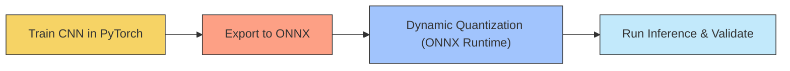
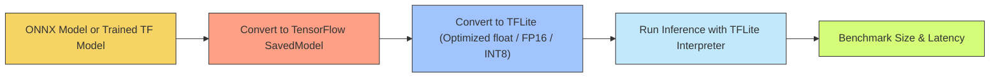
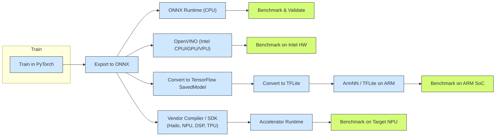

# embedded-ai-model-export
Hands-on project: PyTorch → ONNX → Quantization → Inference (MNIST example)

[](https://colab.research.google.com/github/Shra1surya/embedded-ai-model-export/blob/main/day1_pytorch_to_onnx_quant.ipynb)
[](https://colab.research.google.com/github/Shra1surya/embedded-ai-model-export/blob/main/day2_day3_tflite_conversion_and_inference.ipynb)


# PyTorch → ONNX → Quantization Demo (MNIST)

This is a hands-on mini-project to demonstrate:
- Training a simple CNN using PyTorch on the MNIST dataset
- Exporting the model to ONNX format
- Quantizing the ONNX model to reduce its size
- Running inference using ONNX Runtime
- Benchmarking performance of original vs quantized models

## 🧪 Results

### Prediction:
Expected inference for: (digit 4)


**Outcome:**
output: ONNX Prediction: 4 | Actual Label: 4

### Model Size Comparison:
```bash
-rw-r--r-- 1 root root 87K Aug  8 12:52 mnist_model.onnx
-rw-r--r-- 1 root root 28K Aug  8 13:06 mnist_model_quant.onnx
```

### Execution time comparison:

| Model                 | Size     | Inference Time (CPU) |
|----------------------|----------|-----------------------|
| `mnist_model.onnx`   | ~1.3 MB  | ~0.023 ms             |
| `mnist_model_quant_uint8.onnx` | ~450 KB | ~0.043 ms  |

> ⚠️ ONNX Runtime on x86 doesn’t accelerate ConvInteger ops. Better gains expected on ARM/embedded targets.

## 📦 TFLite Results (Trained TF → TFLite)

- **TFLite (optimized float)**: `mnist_model.tflite` → **27.16 KB**
- **TFLite FP16**: `mnist_model_fp16.tflite` → **46.78 KB**
- **Accuracy checks**:
  - Method A (Keras test sample): ✅ Pred **7**, Label **7**
  - Method B (torchvision sample): ✅ Pred **7**, Label **7**
- **Latency (CPU, 100 runs avg)**: **0.025 ms**

> Notes:
> - ONNX dynamic quantization reduced size on the ONNX path, but ONNX Runtime CPU didn’t accelerate ConvInteger ops.
> - TFLite conversion succeeded; on this tiny network, the default optimized float model is smaller than FP16.
> - Real embedded targets (ARM/NPUs/MCUs) typically show bigger benefits from INT8 quantization and accelerator kernels.

---

---
## 🧪 Reproduce locally (CPU)

```bash
# 1) Create a clean env (recommended)
python -m venv .venv && source .venv/bin/activate    # Windows: .venv\Scripts\activate

# 2) Install deps
pip install -r requirements.txt

# 3) Run Day 1 (PyTorch → ONNX → Quantization)
# Open the notebook and run all cells:
#   day1_pytorch_to_onnx_quant.ipynb

# 4) Run Day 2/3 (TF → TFLite → Inference + Benchmark)
# Open the notebook and run all cells:
#   day2_day3_tflite_conversion_and_inference.ipynb
```
## Why ONNX

ONNX (Open Neural Network Exchange) is a common model format that lets you train in one framework (e.g., PyTorch) and run or optimize in many others — making it easy to deploy AI models across platforms and toolchains.

## Why TFLite

TensorFlow Lite is a lightweight, optimized runtime for running AI models on edge devices (phones, microcontrollers, NPUs), where size, speed, and low power consumption are critical.

## Why Quantization

Quantization reduces model size and speeds up inference by storing weights and activations in lower-precision formats (e.g., 8-bit integers instead of 32-bit floats) — often with minimal impact on accuracy, especially for well-trained models.

## ✅ What I Learned

* [Day 1: PyTorch → ONNX → Quant](./day1_pytorch_to_onnx_quant.ipynb)

* [Day 2/3: TF → TFLite + Benchmarks](./day2_day3_tflite_conversion_and_inference.ipynb)

### Hardware Aware deployment map:

#### Where hardware fits:
Start with an interchange format (ONNX), then choose the runtime/SDK that matches your target:

    * Intel SoC: OpenVINO (CPU/iGPU/VPU)
    * ARM SoC: ArmNN or TFLite (CPU, Ethos‑U microNPU)
    * Dedicated NPU (e.g., Hailo): Use vendor compiler + runtime
    You keep one source model and branch your deployment to the best backend for the device.

#### Other topics covered
- How to convert a PyTorch model to ONNX
- How to apply dynamic quantization with ONNX Runtime
- How quantization affects model size and inference time
- Practical insights into edge/embedded AI deployment pipelines

## What I Did & Why (in that order)

### Step 1 – Train a Model in PyTorch

    What: Built a small CNN to classify MNIST digits.

    Why first: PyTorch is widely used for prototyping; training here gives us a working model with learned weights.

    Why MNIST: Small, easy to train in seconds, yet allows us to demonstrate all conversion and optimization steps without large datasets or hardware.

### Step 2 – Export to ONNX

    What: Saved the PyTorch model in the ONNX (Open Neural Network Exchange) format.

    Why next: ONNX is an interchange format that lets you move models between frameworks (PyTorch → TensorFlow, etc.) and leverage optimization/inference engines like ONNX Runtime without retraining.

### Step 3 – Quantization (ONNX Runtime)

    What: Applied dynamic quantization (weights stored as 8-bit integers instead of 32-bit floats).

    Why: Reduces file size and can speed up inference — especially on CPUs/MCUs with good INT8 support — without needing retraining.

    Why now: Doing it before moving to other runtimes lets us compare “full-precision” vs “quantized” versions at the ONNX stage.

### Step 4 – ONNX Inference & Benchmark

    What: Ran the original and quantized ONNX models using ONNX Runtime.

    Why: Confirms the exported model still works and lets us measure latency/accuracy before converting to other formats.

### Step 5 – ONNX → TensorFlow SavedModel

    What: Converted the ONNX model to TensorFlow’s SavedModel format (or trained a TF model directly as a fallback).

    Why: TensorFlow Lite (TFLite) conversion requires a TF model. This is the bridge between ONNX and TFLite.

### Step 6 – TensorFlow → TFLite Conversion

    What: Converted the SavedModel to .tflite format, applying optimization flags (default float, FP16, or INT8).

    Why: TFLite is a lightweight runtime for mobile/embedded/edge devices — much smaller and faster than full TensorFlow.

### Step 7 – TFLite Inference & Benchmark

    What: Ran the .tflite models using the TFLite Interpreter in Python.

    Why: Verifies functionality and measures inference latency, simulating what you’d see on an embedded device (though real devices may differ).

### Step 8 – Compare Sizes, Latency, and Accuracy

    What: Logged model sizes and average inference time for float vs quantized.

    Why last: This is the payoff — you can show quantitative benefits of model optimizations for embedded use cases.

### Why this order works:

    Each step validates the model before adding more complexity.

    We move from training → interchange format → optimization → deployment format — the same sequence used in real embedded AI workflows.

    At each conversion, we can stop, debug, or measure without guessing where an issue came from.

---

## 📂 Project Structure
```bash
embedded-ai-model-export/
├── day1_pytorch_to_onnx_quant.ipynb
├── day2_day3_tflite_conversion_and_inference.ipynb
├── models/
│   ├── mnist_model.onnx
│   ├── mnist_model_quant_uint8.onnx
│   ├── mnist_model.tflite
│   └── mnist_model_fp16.tflite
├── README.md
```

---

## 🚀 Next Steps

- Try converting to TFLite and run on microcontrollers
- Test ONNX inference on Raspberry Pi or ARM boards
- Explore static quantization or QAT

---
## 📄 Model Card (Mini)

**Model**: Small CNN for MNIST digit classification (2 conv + 2 FC)  
**Task**: Image classification (10 classes, 28×28 grayscale)  
**Datasets**: MNIST (train/test splits from Keras & TorchVision)  
**Training**: Adam, 1–2 epochs (demo scale), cross‑entropy loss  
**Intended use**: Educational demo for embedded‑AI workflows (PyTorch → ONNX → TFLite), not for production  
**Metrics (indicative)**: 97–99% test accuracy after 2 epochs (varies), TFLite latency ~0.025 ms (CPU sim)  
**Artifacts**:
- `models/mnist_model.onnx` (original ONNX)
- `models/mnist_model_quant_uint8.onnx` (ONNX dynamic quantized)
- `models/mnist_model.tflite` (optimized float)
- `models/mnist_model_fp16.tflite` (FP16 weights)
**Limitations**:
- Trained briefly; not robust to domain shift or adversarial inputs
- CPU benchmarks simulate embedded behavior; real devices may differ
- ONNX Runtime CPU does not accelerate ConvInteger ops; quantized speedups are hardware‑dependent
**License**: MIT (see LICENSE)


## 🧠 Author

**Shravan Suryanarayana**  
System Software Architect | Embedded AI Explorer  
[LinkedIn](https://linkedin.com/in/shravansurya)
