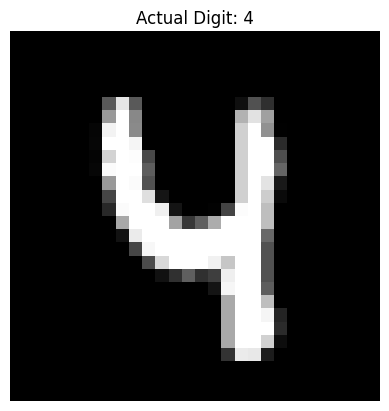

# embedded-ai-model-export
Hands-on project: PyTorch → ONNX → Quantization → Inference (MNIST example)

# PyTorch → ONNX → Quantization Demo (MNIST)

This is a hands-on mini-project to demonstrate:
- Training a simple CNN using PyTorch on the MNIST dataset
- Exporting the model to ONNX format
- Quantizing the ONNX model to reduce its size
- Running inference using ONNX Runtime
- Benchmarking performance of original vs quantized models

---

## 🧪 Results

### Prediction:
Expected inference for: (digit 4)

**Outcome:**
output: ONNX Prediction: 4 | Actual Label: 4

### Model Size Comparison:

-rw-r--r-- 1 root root 87K Aug  8 12:52 mnist_model.onnx
-rw-r--r-- 1 root root 28K Aug  8 13:06 mnist_model_quant.onnx

### Execution time comparison:

| Model                 | Size     | Inference Time (CPU) |
|----------------------|----------|-----------------------|
| `mnist_model.onnx`   | ~1.3 MB  | ~0.023 ms             |
| `mnist_model_quant_uint8.onnx` | ~450 KB | ~0.043 ms  |

> ⚠️ ONNX Runtime on x86 doesn’t accelerate ConvInteger ops. Better gains expected on ARM/embedded targets.

## 📦 TFLite Results (Trained TF → TFLite)

- **TFLite (optimized float)**: `mnist_model.tflite` → **27.16 KB**
- **TFLite FP16**: `mnist_model_fp16.tflite` → **46.78 KB**
- **Accuracy checks**:
  - Method A (Keras test sample): ✅ Pred **7**, Label **7**
  - Method B (torchvision sample): ✅ Pred **7**, Label **7**
- **Latency (CPU, 100 runs avg)**: **0.025 ms**

> Notes:
> - ONNX dynamic quantization reduced size on the ONNX path, but ONNX Runtime CPU didn’t accelerate ConvInteger ops.
> - TFLite conversion succeeded; on this tiny network, the default optimized float model is smaller than FP16.
> - Real embedded targets (ARM/NPUs/MCUs) typically show bigger benefits from INT8 quantization and accelerator kernels.

---

## ✅ What I Learned

* [Day 1: PyTorch → ONNX → Quant](./day1_pytorch_to_onnx_quant.ipynb)
* [Day 2/3: TF → TFLite + Benchmarks](./day2_day3_tflite_conversion_and_inference.ipynb)

- How to convert a PyTorch model to ONNX
- How to apply dynamic quantization with ONNX Runtime
- How quantization affects model size and inference time
- Practical insights into edge/embedded AI deployment pipelines

---

## 📂 Project Structure

embedded-ai-model-export/
├── day1_pytorch_to_onnx_quant.ipynb
├── day2_day3_tflite_conversion_and_inference.ipynb
├── models/
│   ├── mnist_model.onnx
│   ├── mnist_model_quant_uint8.onnx
│   ├── mnist_model.tflite
│   └── mnist_model_fp16.tflite
├── README.md

---

## 🚀 Next Steps

- Try converting to TFLite and run on microcontrollers
- Test ONNX inference on Raspberry Pi or ARM boards
- Explore static quantization or QAT

---

## 🧠 Author

**Shravan Suryanarayana**  
System Software Architect | Embedded AI Explorer  
[LinkedIn](https://linkedin.com/in/shravansurya)
